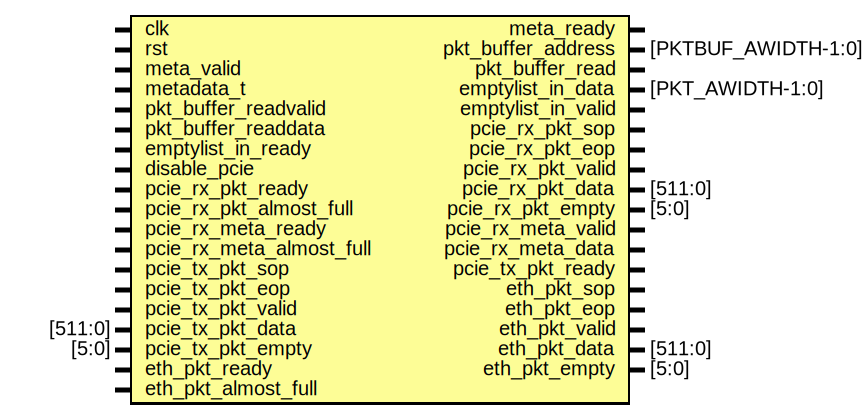
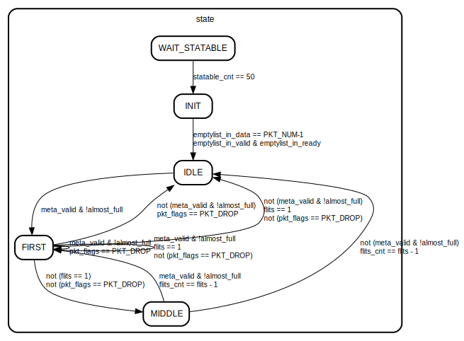

# Entity: basic_data_mover

- **File**: basic_data_mover.sv
## Diagram

## Ports

| Port name                | Direction | Type                | Description |
| ------------------------ | --------- | ------------------- | ----------- |
| clk                      | input     |                     |             |
| rst                      | input     |                     |             |
| meta_valid               | input     |                     |             |
| metadata_t               | input     |                     |             |
| meta_ready               | output    |                     |             |
| pkt_buffer_address       | output    | [PKTBUF_AWIDTH-1:0] |             |
| pkt_buffer_read          | output    |                     |             |
| pkt_buffer_readvalid     | input     |                     |             |
| pkt_buffer_readdata      | input     |                     |             |
| emptylist_in_data        | output    | [PKT_AWIDTH-1:0]    |             |
| emptylist_in_valid       | output    |                     |             |
| emptylist_in_ready       | input     |                     |             |
| disable_pcie             | input     |                     |             |
| pcie_rx_pkt_sop          | output    |                     |             |
| pcie_rx_pkt_eop          | output    |                     |             |
| pcie_rx_pkt_valid        | output    |                     |             |
| pcie_rx_pkt_data         | output    | [511:0]             |             |
| pcie_rx_pkt_empty        | output    | [5:0]               |             |
| pcie_rx_pkt_ready        | input     |                     |             |
| pcie_rx_pkt_almost_full  | input     |                     |             |
| pcie_rx_meta_valid       | output    |                     |             |
| pcie_rx_meta_data        | output    |                     |             |
| pcie_rx_meta_ready       | input     |                     |             |
| pcie_rx_meta_almost_full | input     |                     |             |
| pcie_tx_pkt_sop          | input     |                     |             |
| pcie_tx_pkt_eop          | input     |                     |             |
| pcie_tx_pkt_valid        | input     |                     |             |
| pcie_tx_pkt_data         | input     | [511:0]             |             |
| pcie_tx_pkt_empty        | input     | [5:0]               |             |
| pcie_tx_pkt_ready        | output    |                     |             |
| eth_pkt_sop              | output    |                     |             |
| eth_pkt_eop              | output    |                     |             |
| eth_pkt_valid            | output    |                     |             |
| eth_pkt_data             | output    | [511:0]             |             |
| eth_pkt_empty            | output    | [5:0]               |             |
| eth_pkt_ready            | input     |                     |             |
| eth_pkt_almost_full      | input     |                     |             |
## Instantiations

- hp_flags: hyper_pipe
## State machines

