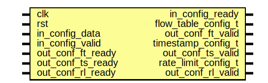

# Entity: configurator

- **File**: configurator.sv
## Diagram

## Ports

| Port name           | Direction | Type | Description |
| ------------------- | --------- | ---- | ----------- |
| clk                 | input     |      |             |
| rst                 | input     |      |             |
| in_config_data      | input     |      |             |
| in_config_valid     | input     |      |             |
| in_config_ready     | output    |      |             |
| flow_table_config_t | output    |      |             |
| out_conf_ft_valid   | output    |      |             |
| out_conf_ft_ready   | input     |      |             |
| timestamp_config_t  | output    |      |             |
| out_conf_ts_valid   | output    |      |             |
| out_conf_ts_ready   | input     |      |             |
| rate_limit_config_t | output    |      |             |
| out_conf_rl_valid   | output    |      |             |
| out_conf_rl_ready   | input     |      |             |
