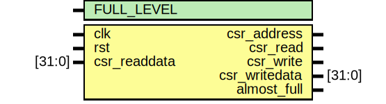

# Entity: dc_back_pressure

- **File**: dc_back_pressure.sv
## Diagram

## Generics

| Generic name | Type | Value | Description |
| ------------ | ---- | ----- | ----------- |
| FULL_LEVEL   |      | 490   |             |
## Ports

| Port name     | Direction | Type   | Description |
| ------------- | --------- | ------ | ----------- |
| clk           | input     |        |             |
| rst           | input     |        |             |
| csr_address   | output    |        |             |
| csr_read      | output    |        |             |
| csr_write     | output    |        |             |
| csr_readdata  | input     | [31:0] |             |
| csr_writedata | output    | [31:0] |             |
| almost_full   | output    |        |             |
