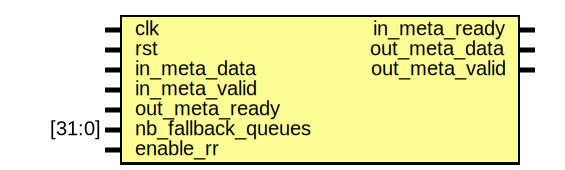

# Entity: flow_director

- **File**: flow_director.sv
## Diagram

## Ports

| Port name                | Direction | Type | Description |
| ------------------------ | --------- | ---- | ----------- |
| clk                      | input     |      |             |
| rst                      | input     |      |             |
| in_meta_data             | input     |      |             |
| in_meta_valid            | input     |      |             |
| in_meta_ready            | output    |      |             |
| out_meta_data            | output    |      |             |
| out_meta_valid           | output    |      |             |
| out_meta_ready           | input     |      |             |
| fallback_queues_config_t | input     |      |             |
| conf_fd_valid            | input     |      |             |
| conf_fd_ready            | output    |      |             |
