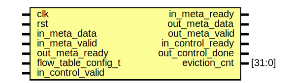
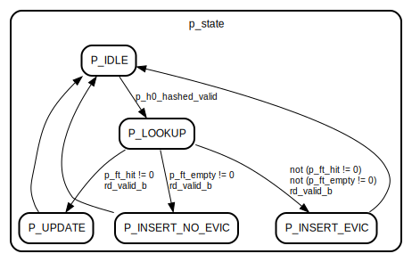

# Entity: flow_table_wrapper

- **File**: flow_table_wrapper.sv
## Diagram

## Ports

| Port name           | Direction | Type   | Description |
| ------------------- | --------- | ------ | ----------- |
| clk                 | input     |        |             |
| rst                 | input     |        |             |
| in_meta_data        | input     |        |             |
| in_meta_valid       | input     |        |             |
| in_meta_ready       | output    |        |             |
| out_meta_data       | output    |        |             |
| out_meta_valid      | output    |        |             |
| out_meta_ready      | input     |        |             |
| flow_table_config_t | input     |        |             |
| in_control_valid    | input     |        |             |
| in_control_ready    | output    |        |             |
| out_control_done    | output    |        |             |
| eviction_cnt        | output    | [31:0] |             |
## Instantiations

- s_hash0: hash_func
- s_hash1: hash_func
- s_hash2: hash_func
- s_hash3: hash_func
- p_hash0: hash_func
- p_hash1: hash_func
- p_hash2: hash_func
- p_hash3: hash_func
- FT_0: bram_true2port
- FT_1: bram_true2port
- FT_2: bram_true2port
- FT_3: bram_true2port
## State machines

