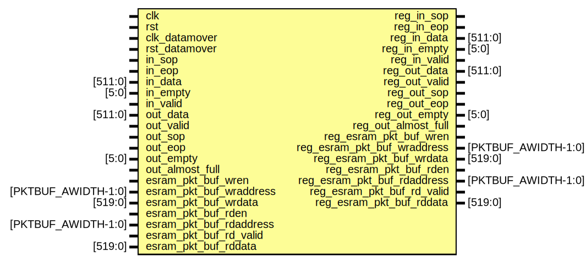

# Entity: hyper_pipe_root

- **File**: hyper_pipe_root.sv
## Diagram

## Ports

| Port name                   | Direction | Type                | Description |
| --------------------------- | --------- | ------------------- | ----------- |
| clk                         | input     |                     |             |
| rst                         | input     |                     |             |
| clk_datamover               | input     |                     |             |
| rst_datamover               | input     |                     |             |
| in_sop                      | input     |                     |             |
| in_eop                      | input     |                     |             |
| in_data                     | input     | [511:0]             |             |
| in_empty                    | input     | [5:0]               |             |
| in_valid                    | input     |                     |             |
| out_data                    | input     | [511:0]             |             |
| out_valid                   | input     |                     |             |
| out_sop                     | input     |                     |             |
| out_eop                     | input     |                     |             |
| out_empty                   | input     | [5:0]               |             |
| out_almost_full             | input     |                     |             |
| esram_pkt_buf_wren          | input     |                     |             |
| esram_pkt_buf_wraddress     | input     | [PKTBUF_AWIDTH-1:0] |             |
| esram_pkt_buf_wrdata        | input     | [519:0]             |             |
| esram_pkt_buf_rden          | input     |                     |             |
| esram_pkt_buf_rdaddress     | input     | [PKTBUF_AWIDTH-1:0] |             |
| esram_pkt_buf_rd_valid      | input     |                     |             |
| esram_pkt_buf_rddata        | input     | [519:0]             |             |
| reg_in_sop                  | output    |                     |             |
| reg_in_eop                  | output    |                     |             |
| reg_in_data                 | output    | [511:0]             |             |
| reg_in_empty                | output    | [5:0]               |             |
| reg_in_valid                | output    |                     |             |
| reg_out_data                | output    | [511:0]             |             |
| reg_out_valid               | output    |                     |             |
| reg_out_sop                 | output    |                     |             |
| reg_out_eop                 | output    |                     |             |
| reg_out_empty               | output    | [5:0]               |             |
| reg_out_almost_full         | output    |                     |             |
| reg_esram_pkt_buf_wren      | output    |                     |             |
| reg_esram_pkt_buf_wraddress | output    | [PKTBUF_AWIDTH-1:0] |             |
| reg_esram_pkt_buf_wrdata    | output    | [519:0]             |             |
| reg_esram_pkt_buf_rden      | output    |                     |             |
| reg_esram_pkt_buf_rdaddress | output    | [PKTBUF_AWIDTH-1:0] |             |
| reg_esram_pkt_buf_rd_valid  | output    |                     |             |
| reg_esram_pkt_buf_rddata    | output    | [519:0]             |             |
## Instantiations

- hp_in_sop: hyper_pipe
- hp_in_eop: hyper_pipe
- hp_in_data: hyper_pipe
- hp_in_empty: hyper_pipe
- hp_in_valid: hyper_pipe_rst
- hp_out_data: hyper_pipe
- hp_out_valid: hyper_pipe_rst
- hp_out_sop: hyper_pipe
- hp_out_eop: hyper_pipe
- hp_out_empty: hyper_pipe
- hp_out_almost_full: hyper_pipe_rst
- hp_esram_pkt_buf_wren: hyper_pipe_rst
- hp_esram_pkt_buf_wraddress: hyper_pipe
- hp_esram_pkt_buf_wrdata: hyper_pipe
- hp_esram_pkt_buf_rden: hyper_pipe_rst
- hp_esram_pkt_buf_rdaddress: hyper_pipe
- hp_esram_pkt_buf_rd_valid: hyper_pipe_rst
- hp_esram_pkt_buf_rddata: hyper_pipe
