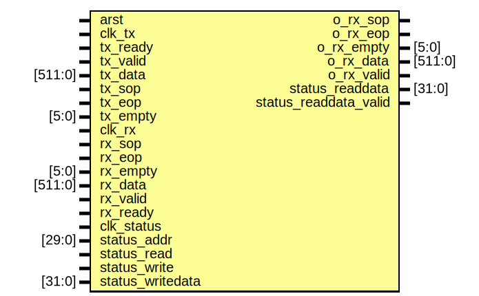

# Entity: my_stats

- **File**: my_stats.sv
## Diagram

## Ports

| Port name             | Direction | Type    | Description |
| --------------------- | --------- | ------- | ----------- |
| arst                  | input     |         |             |
| clk_tx                | input     |         |             |
| tx_ready              | input     |         |             |
| tx_valid              | input     |         |             |
| tx_data               | input     | [511:0] |             |
| tx_sop                | input     |         |             |
| tx_eop                | input     |         |             |
| tx_empty              | input     | [5:0]   |             |
| clk_rx                | input     |         |             |
| rx_sop                | input     |         |             |
| rx_eop                | input     |         |             |
| rx_empty              | input     | [5:0]   |             |
| rx_data               | input     | [511:0] |             |
| rx_valid              | input     |         |             |
| rx_ready              | input     |         |             |
| o_rx_sop              | output    |         |             |
| o_rx_eop              | output    |         |             |
| o_rx_empty            | output    | [5:0]   |             |
| o_rx_data             | output    | [511:0] |             |
| o_rx_valid            | output    |         |             |
| clk_status            | input     |         |             |
| status_addr           | input     | [29:0]  |             |
| status_read           | input     |         |             |
| status_write          | input     |         |             |
| status_writedata      | input     | [31:0]  |             |
| status_readdata       | output    | [31:0]  |             |
| status_readdata_valid | output    |         |             |
## Processes
- unnamed: ( @(posedge clk_status) )
  - **Type:** always
  - **Description**
 //////////////////////// ///////////////////////
- unnamed: ( @(posedge clk_rx) )
  - **Type:** always
  - **Description**
 //////////////////////// ///////////////////////
- unnamed: ( @(posedge clk_tx) )
  - **Type:** always
  - **Description**
 //////////////////////// ///////////////////////
