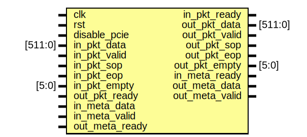

# Entity: parser

- **File**: parser.sv
## Diagram

## Description

## Ports

| Port name      | Direction | Type    | Description |
| -------------- | --------- | ------- | ----------- |
| clk            | input     |         |             |
| rst            | input     |         |             |
| disable_pcie   | input     |         |             |
| in_pkt_data    | input     | [511:0] |             |
| in_pkt_valid   | input     |         |             |
| in_pkt_ready   | output    |         |             |
| in_pkt_sop     | input     |         |             |
| in_pkt_eop     | input     |         |             |
| in_pkt_empty   | input     | [5:0]   |             |
| out_pkt_data   | output    | [511:0] |             |
| out_pkt_valid  | output    |         |             |
| out_pkt_ready  | input     |         |             |
| out_pkt_sop    | output    |         |             |
| out_pkt_eop    | output    |         |             |
| out_pkt_empty  | output    | [5:0]   |             |
| in_meta_data   | input     |         |             |
| in_meta_valid  | input     |         |             |
| in_meta_ready  | output    |         |             |
| out_meta_data  | output    |         |             |
| out_meta_valid | output    |         |             |
| out_meta_ready | input     |         |             |
