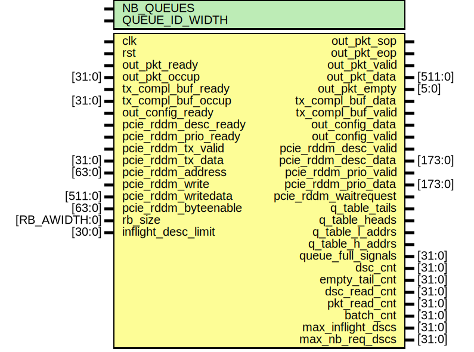
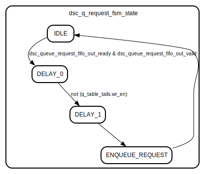
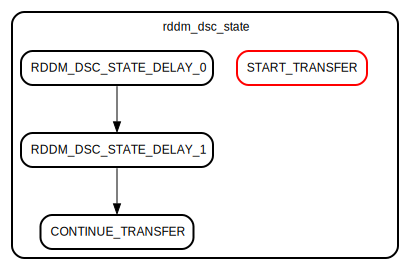

# Entity: cpu_to_fpga

- **File**: cpu_to_fpga.sv
## Diagram

## Description

 This module implements the communication from the CPU to the FPGA (TX). It
 is also responsible for managing the TX descriptor queue BRAMs. It outputs
 both packets and configuration requests.

## Generics

| Generic name   | Type | Value             | Description |
| -------------- | ---- | ----------------- | ----------- |
| NB_QUEUES      |      | undefined         |             |
| QUEUE_ID_WIDTH |      | $clog2(NB_QUEUES) |             |
## Ports

| Port name             | Direction | Type          | Description                                        |
| --------------------- | --------- | ------------- | -------------------------------------------------- |
| clk                   | input     |               |                                                    |
| rst                   | input     |               |                                                    |
| out_pkt_sop           | output    |               | Packet buffer output.                              |
| out_pkt_eop           | output    |               |                                                    |
| out_pkt_valid         | output    |               |                                                    |
| out_pkt_data          | output    | [511:0]       |                                                    |
| out_pkt_empty         | output    | [5:0]         |                                                    |
| out_pkt_ready         | input     |               |                                                    |
| out_pkt_occup         | input     | [31:0]        |                                                    |
| tx_compl_buf_data     | output    |               | TX completion buffer output.                       |
| tx_compl_buf_valid    | output    |               |                                                    |
| tx_compl_buf_ready    | input     |               |                                                    |
| tx_compl_buf_occup    | input     | [31:0]        |                                                    |
| out_config_data       | output    |               | Config buffer output.                              |
| out_config_valid      | output    |               |                                                    |
| out_config_ready      | input     |               |                                                    |
| pcie_rddm_desc_ready  | input     |               | PCIe Read Data Mover (RDDM) signals.               |
| pcie_rddm_desc_valid  | output    |               |                                                    |
| pcie_rddm_desc_data   | output    | [173:0]       |                                                    |
| pcie_rddm_prio_ready  | input     |               |                                                    |
| pcie_rddm_prio_valid  | output    |               |                                                    |
| pcie_rddm_prio_data   | output    | [173:0]       |                                                    |
| pcie_rddm_tx_valid    | input     |               |                                                    |
| pcie_rddm_tx_data     | input     | [31:0]        |                                                    |
| pcie_rddm_address     | input     | [63:0]        |                                                    |
| pcie_rddm_write       | input     |               |                                                    |
| pcie_rddm_writedata   | input     | [511:0]       |                                                    |
| pcie_rddm_byteenable  | input     | [63:0]        |                                                    |
| pcie_rddm_waitrequest | output    |               |                                                    |
| q_table_tails         | output    |               | BRAM signals for TX descriptor queues.             |
| q_table_heads         | output    |               |                                                    |
| q_table_l_addrs       | output    |               |                                                    |
| q_table_h_addrs       | output    |               |                                                    |
| rb_size               | input     | [RB_AWIDTH:0] | Configure ring buffer size.                        |
| inflight_desc_limit   | input     | [30:0]        | Configure maximum number of in-flight descriptors. |
| queue_full_signals    | output    | [31:0]        | Counters.                                          |
| dsc_cnt               | output    | [31:0]        |                                                    |
| empty_tail_cnt        | output    | [31:0]        |                                                    |
| dsc_read_cnt          | output    | [31:0]        |                                                    |
| pkt_read_cnt          | output    | [31:0]        |                                                    |
| batch_cnt             | output    | [31:0]        |                                                    |
| max_inflight_dscs     | output    | [31:0]        |                                                    |
| max_nb_req_dscs       | output    | [31:0]        |                                                    |
## Instantiations

- q_table_a_tails: bram_interface_io
- q_table_a_heads: bram_interface_io
- q_table_a_l_addrs: bram_interface_io
- q_table_a_h_addrs: bram_interface_io
- q_table_b_l_addrs: bram_interface_io
- q_table_b_h_addrs: bram_interface_io
- dsc_q_status: bram_simple2port
- dsc_queue_request_fifo: fifo_wrapper_infill_mlab
## State machines

