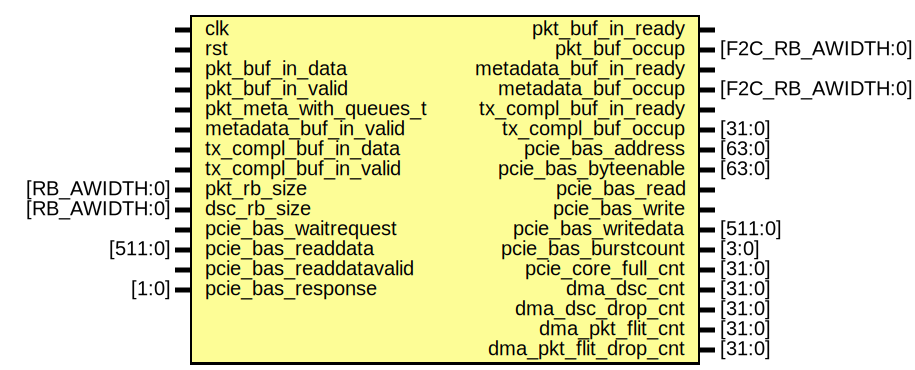
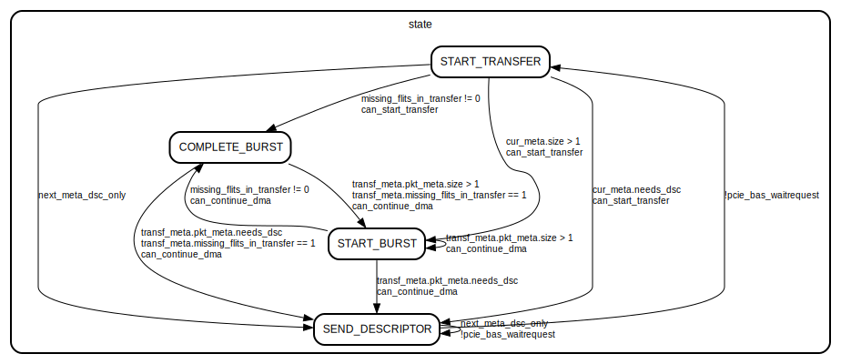

# Entity: fpga_to_cpu

- **File**: fpga_to_cpu.sv
## Diagram

## Description

## Ports

| Port name              | Direction | Type              | Description |
| ---------------------- | --------- | ----------------- | ----------- |
| clk                    | input     |                   |             |
| rst                    | input     |                   |             |
| pkt_buf_in_data        | input     |                   |             |
| pkt_buf_in_valid       | input     |                   |             |
| pkt_buf_in_ready       | output    |                   |             |
| pkt_buf_occup          | output    | [F2C_RB_AWIDTH:0] |             |
| pkt_meta_with_queues_t | input     |                   |             |
| metadata_buf_in_valid  | input     |                   |             |
| metadata_buf_in_ready  | output    |                   |             |
| metadata_buf_occup     | output    | [F2C_RB_AWIDTH:0] |             |
| tx_compl_buf_in_data   | input     |                   |             |
| tx_compl_buf_in_valid  | input     |                   |             |
| tx_compl_buf_in_ready  | output    |                   |             |
| tx_compl_buf_occup     | output    | [31:0]            |             |
| pkt_rb_size            | input     | [RB_AWIDTH:0]     |             |
| dsc_rb_size            | input     | [RB_AWIDTH:0]     |             |
| pcie_bas_waitrequest   | input     |                   |             |
| pcie_bas_address       | output    | [63:0]            |             |
| pcie_bas_byteenable    | output    | [63:0]            |             |
| pcie_bas_read          | output    |                   |             |
| pcie_bas_readdata      | input     | [511:0]           |             |
| pcie_bas_readdatavalid | input     |                   |             |
| pcie_bas_write         | output    |                   |             |
| pcie_bas_writedata     | output    | [511:0]           |             |
| pcie_bas_burstcount    | output    | [3:0]             |             |
| pcie_bas_response      | input     | [1:0]             |             |
| pcie_core_full_cnt     | output    | [31:0]            |             |
| dma_dsc_cnt            | output    | [31:0]            |             |
| dma_dsc_drop_cnt       | output    | [31:0]            |             |
| dma_pkt_flit_cnt       | output    | [31:0]            |             |
| dma_pkt_flit_drop_cnt  | output    | [31:0]            |             |
## State machines

