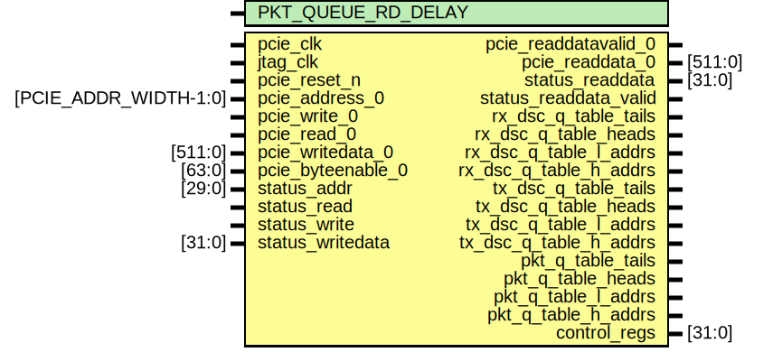

# Entity: jtag_mmio_arbiter

- **File**: jtag_mmio_arbiter.sv
## Diagram

## Description

## Generics

| Generic name       | Type | Value | Description |
| ------------------ | ---- | ----- | ----------- |
| PKT_QUEUE_RD_DELAY |      | 2     |             |
## Ports

| Port name              | Direction | Type                  | Description |
| ---------------------- | --------- | --------------------- | ----------- |
| pcie_clk               | input     |                       |             |
| jtag_clk               | input     |                       |             |
| pcie_reset_n           | input     |                       |             |
| pcie_address_0         | input     | [PCIE_ADDR_WIDTH-1:0] |             |
| pcie_write_0           | input     |                       |             |
| pcie_read_0            | input     |                       |             |
| pcie_readdatavalid_0   | output    |                       |             |
| pcie_readdata_0        | output    | [511:0]               |             |
| pcie_writedata_0       | input     | [511:0]               |             |
| pcie_byteenable_0      | input     | [63:0]                |             |
| status_addr            | input     | [29:0]                |             |
| status_read            | input     |                       |             |
| status_write           | input     |                       |             |
| status_writedata       | input     | [31:0]                |             |
| status_readdata        | output    | [31:0]                |             |
| status_readdata_valid  | output    |                       |             |
| rx_dsc_q_table_tails   | output    |                       |             |
| rx_dsc_q_table_heads   | output    |                       |             |
| rx_dsc_q_table_l_addrs | output    |                       |             |
| rx_dsc_q_table_h_addrs | output    |                       |             |
| tx_dsc_q_table_tails   | output    |                       |             |
| tx_dsc_q_table_heads   | output    |                       |             |
| tx_dsc_q_table_l_addrs | output    |                       |             |
| tx_dsc_q_table_h_addrs | output    |                       |             |
| pkt_q_table_tails      | output    |                       |             |
| pkt_q_table_heads      | output    |                       |             |
| pkt_q_table_l_addrs    | output    |                       |             |
| pkt_q_table_h_addrs    | output    |                       |             |
| control_regs           | output    | [31:0]                |             |
## Instantiations

- jtag_to_pcie_fifo: dc_fifo_reg_core
- jtag_to_pcie_wr_data_fifo: dc_fifo_reg_core
- pcie_to_jtag_fifo: dc_fifo_reg_core
