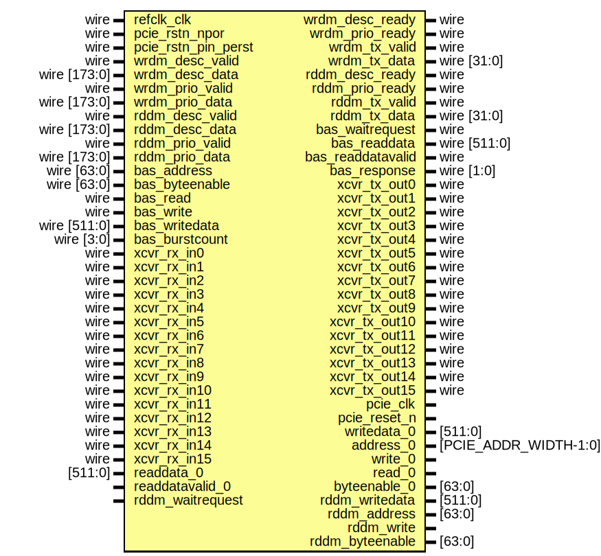

# Entity: pcie_core

- **File**: pcie_core.sv
## Diagram

## Ports

| Port name           | Direction | Type                  | Description |
| ------------------- | --------- | --------------------- | ----------- |
| refclk_clk          | input     | wire                  |             |
| pcie_rstn_npor      | input     | wire                  |             |
| pcie_rstn_pin_perst | input     | wire                  |             |
| wrdm_desc_ready     | output    | wire                  |             |
| wrdm_desc_valid     | input     | wire                  |             |
| wrdm_desc_data      | input     | wire [173:0]          |             |
| wrdm_prio_ready     | output    | wire                  |             |
| wrdm_prio_valid     | input     | wire                  |             |
| wrdm_prio_data      | input     | wire [173:0]          |             |
| wrdm_tx_valid       | output    | wire                  |             |
| wrdm_tx_data        | output    | wire [31:0]           |             |
| rddm_desc_ready     | output    | wire                  |             |
| rddm_desc_valid     | input     | wire                  |             |
| rddm_desc_data      | input     | wire [173:0]          |             |
| rddm_prio_ready     | output    | wire                  |             |
| rddm_prio_valid     | input     | wire                  |             |
| rddm_prio_data      | input     | wire [173:0]          |             |
| rddm_tx_valid       | output    | wire                  |             |
| rddm_tx_data        | output    | wire [31:0]           |             |
| bas_waitrequest     | output    | wire                  |             |
| bas_address         | input     | wire [63:0]           |             |
| bas_byteenable      | input     | wire [63:0]           |             |
| bas_read            | input     | wire                  |             |
| bas_readdata        | output    | wire [511:0]          |             |
| bas_readdatavalid   | output    | wire                  |             |
| bas_write           | input     | wire                  |             |
| bas_writedata       | input     | wire [511:0]          |             |
| bas_burstcount      | input     | wire [3:0]            |             |
| bas_response        | output    | wire [1:0]            |             |
| xcvr_rx_in0         | input     | wire                  |             |
| xcvr_rx_in1         | input     | wire                  |             |
| xcvr_rx_in2         | input     | wire                  |             |
| xcvr_rx_in3         | input     | wire                  |             |
| xcvr_rx_in4         | input     | wire                  |             |
| xcvr_rx_in5         | input     | wire                  |             |
| xcvr_rx_in6         | input     | wire                  |             |
| xcvr_rx_in7         | input     | wire                  |             |
| xcvr_rx_in8         | input     | wire                  |             |
| xcvr_rx_in9         | input     | wire                  |             |
| xcvr_rx_in10        | input     | wire                  |             |
| xcvr_rx_in11        | input     | wire                  |             |
| xcvr_rx_in12        | input     | wire                  |             |
| xcvr_rx_in13        | input     | wire                  |             |
| xcvr_rx_in14        | input     | wire                  |             |
| xcvr_rx_in15        | input     | wire                  |             |
| xcvr_tx_out0        | output    | wire                  |             |
| xcvr_tx_out1        | output    | wire                  |             |
| xcvr_tx_out2        | output    | wire                  |             |
| xcvr_tx_out3        | output    | wire                  |             |
| xcvr_tx_out4        | output    | wire                  |             |
| xcvr_tx_out5        | output    | wire                  |             |
| xcvr_tx_out6        | output    | wire                  |             |
| xcvr_tx_out7        | output    | wire                  |             |
| xcvr_tx_out8        | output    | wire                  |             |
| xcvr_tx_out9        | output    | wire                  |             |
| xcvr_tx_out10       | output    | wire                  |             |
| xcvr_tx_out11       | output    | wire                  |             |
| xcvr_tx_out12       | output    | wire                  |             |
| xcvr_tx_out13       | output    | wire                  |             |
| xcvr_tx_out14       | output    | wire                  |             |
| xcvr_tx_out15       | output    | wire                  |             |
| pcie_clk            | output    |                       |             |
| pcie_reset_n        | output    |                       |             |
| readdata_0          | input     | [511:0]               |             |
| readdatavalid_0     | input     |                       |             |
| writedata_0         | output    | [511:0]               |             |
| address_0           | output    | [PCIE_ADDR_WIDTH-1:0] |             |
| write_0             | output    |                       |             |
| read_0              | output    |                       |             |
| byteenable_0        | output    | [63:0]                |             |
| rddm_writedata      | output    | [511:0]               |             |
| rddm_address        | output    | [63:0]                |             |
| rddm_write          | output    |                       |             |
| rddm_byteenable     | output    | [63:0]                |             |
| rddm_waitrequest    | input     |                       |             |
## Instantiations

- pcie: pcie_ed
