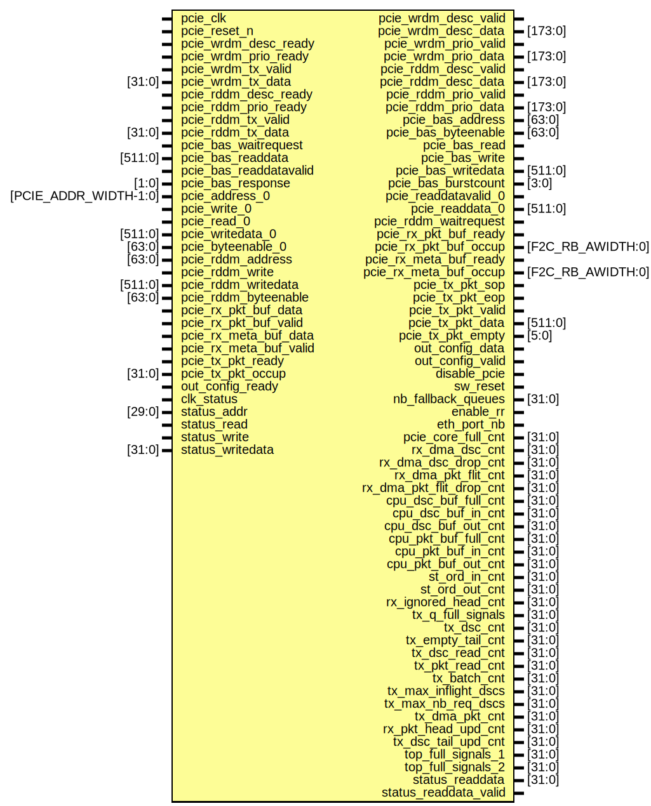

# Entity: pcie_top

- **File**: pcie_top.sv
## Diagram

## Ports

| Port name                | Direction | Type                  | Description |
| ------------------------ | --------- | --------------------- | ----------- |
| pcie_clk                 | input     |                       |             |
| pcie_reset_n             | input     |                       |             |
| pcie_wrdm_desc_ready     | input     |                       |             |
| pcie_wrdm_desc_valid     | output    |                       |             |
| pcie_wrdm_desc_data      | output    | [173:0]               |             |
| pcie_wrdm_prio_ready     | input     |                       |             |
| pcie_wrdm_prio_valid     | output    |                       |             |
| pcie_wrdm_prio_data      | output    | [173:0]               |             |
| pcie_wrdm_tx_valid       | input     |                       |             |
| pcie_wrdm_tx_data        | input     | [31:0]                |             |
| pcie_rddm_desc_ready     | input     |                       |             |
| pcie_rddm_desc_valid     | output    |                       |             |
| pcie_rddm_desc_data      | output    | [173:0]               |             |
| pcie_rddm_prio_ready     | input     |                       |             |
| pcie_rddm_prio_valid     | output    |                       |             |
| pcie_rddm_prio_data      | output    | [173:0]               |             |
| pcie_rddm_tx_valid       | input     |                       |             |
| pcie_rddm_tx_data        | input     | [31:0]                |             |
| pcie_bas_waitrequest     | input     |                       |             |
| pcie_bas_address         | output    | [63:0]                |             |
| pcie_bas_byteenable      | output    | [63:0]                |             |
| pcie_bas_read            | output    |                       |             |
| pcie_bas_readdata        | input     | [511:0]               |             |
| pcie_bas_readdatavalid   | input     |                       |             |
| pcie_bas_write           | output    |                       |             |
| pcie_bas_writedata       | output    | [511:0]               |             |
| pcie_bas_burstcount      | output    | [3:0]                 |             |
| pcie_bas_response        | input     | [1:0]                 |             |
| pcie_address_0           | input     | [PCIE_ADDR_WIDTH-1:0] |             |
| pcie_write_0             | input     |                       |             |
| pcie_read_0              | input     |                       |             |
| pcie_readdatavalid_0     | output    |                       |             |
| pcie_readdata_0          | output    | [511:0]               |             |
| pcie_writedata_0         | input     | [511:0]               |             |
| pcie_byteenable_0        | input     | [63:0]                |             |
| pcie_rddm_address        | input     | [63:0]                |             |
| pcie_rddm_write          | input     |                       |             |
| pcie_rddm_writedata      | input     | [511:0]               |             |
| pcie_rddm_byteenable     | input     | [63:0]                |             |
| pcie_rddm_waitrequest    | output    |                       |             |
| pcie_rx_pkt_buf_data     | input     |                       |             |
| pcie_rx_pkt_buf_valid    | input     |                       |             |
| pcie_rx_pkt_buf_ready    | output    |                       |             |
| pcie_rx_pkt_buf_occup    | output    | [F2C_RB_AWIDTH:0]     |             |
| pcie_rx_meta_buf_data    | input     |                       |             |
| pcie_rx_meta_buf_valid   | input     |                       |             |
| pcie_rx_meta_buf_ready   | output    |                       |             |
| pcie_rx_meta_buf_occup   | output    | [F2C_RB_AWIDTH:0]     |             |
| pcie_tx_pkt_sop          | output    |                       |             |
| pcie_tx_pkt_eop          | output    |                       |             |
| pcie_tx_pkt_valid        | output    |                       |             |
| pcie_tx_pkt_data         | output    | [511:0]               |             |
| pcie_tx_pkt_empty        | output    | [5:0]                 |             |
| pcie_tx_pkt_ready        | input     |                       |             |
| pcie_tx_pkt_occup        | input     | [31:0]                |             |
| out_config_data          | output    |                       |             |
| out_config_valid         | output    |                       |             |
| out_config_ready         | input     |                       |             |
| disable_pcie             | output    |                       |             |
| sw_reset                 | output    |                       |             |
| nb_fallback_queues       | output    | [31:0]                |             |
| enable_rr                | output    |                       |             |
| eth_port_nb              | output    |                       |             |
| pcie_core_full_cnt       | output    | [31:0]                |             |
| rx_dma_dsc_cnt           | output    | [31:0]                |             |
| rx_dma_dsc_drop_cnt      | output    | [31:0]                |             |
| rx_dma_pkt_flit_cnt      | output    | [31:0]                |             |
| rx_dma_pkt_flit_drop_cnt | output    | [31:0]                |             |
| cpu_dsc_buf_full_cnt     | output    | [31:0]                |             |
| cpu_dsc_buf_in_cnt       | output    | [31:0]                |             |
| cpu_dsc_buf_out_cnt      | output    | [31:0]                |             |
| cpu_pkt_buf_full_cnt     | output    | [31:0]                |             |
| cpu_pkt_buf_in_cnt       | output    | [31:0]                |             |
| cpu_pkt_buf_out_cnt      | output    | [31:0]                |             |
| st_ord_in_cnt            | output    | [31:0]                |             |
| st_ord_out_cnt           | output    | [31:0]                |             |
| rx_ignored_head_cnt      | output    | [31:0]                |             |
| tx_q_full_signals        | output    | [31:0]                |             |
| tx_dsc_cnt               | output    | [31:0]                |             |
| tx_empty_tail_cnt        | output    | [31:0]                |             |
| tx_dsc_read_cnt          | output    | [31:0]                |             |
| tx_pkt_read_cnt          | output    | [31:0]                |             |
| tx_batch_cnt             | output    | [31:0]                |             |
| tx_max_inflight_dscs     | output    | [31:0]                |             |
| tx_max_nb_req_dscs       | output    | [31:0]                |             |
| tx_dma_pkt_cnt           | output    | [31:0]                |             |
| rx_pkt_head_upd_cnt      | output    | [31:0]                |             |
| tx_dsc_tail_upd_cnt      | output    | [31:0]                |             |
| top_full_signals_1       | output    | [31:0]                |             |
| top_full_signals_2       | output    | [31:0]                |             |
| clk_status               | input     |                       |             |
| status_addr              | input     | [29:0]                |             |
| status_read              | input     |                       |             |
| status_write             | input     |                       |             |
| status_writedata         | input     | [31:0]                |             |
| status_readdata          | output    | [31:0]                |             |
| status_readdata_valid    | output    |                       |             |
## Instantiations

- head_upd_queue: fifo_wrapper_infill_mlab
- rx_dsc_q_table_tails: bram_interface_io
- rx_dsc_q_table_heads: bram_interface_io
- rx_dsc_q_table_l_addrs: bram_interface_io
- rx_dsc_q_table_h_addrs: bram_interface_io
- tx_dsc_q_table_tails: bram_interface_io
- tx_dsc_q_table_heads: bram_interface_io
- tx_dsc_q_table_l_addrs: bram_interface_io
- tx_dsc_q_table_h_addrs: bram_interface_io
- pkt_q_table_tails: bram_interface_io
- pkt_q_table_heads: bram_interface_io
- pkt_q_table_l_addrs: bram_interface_io
- pkt_q_table_h_addrs: bram_interface_io
- pqm_pkt_q_table_tails[NB_PKT_QUEUE_MANAGERS]: bram_interface_io
- pqm_pkt_q_table_heads[NB_PKT_QUEUE_MANAGERS]: bram_interface_io
- pqm_pkt_q_table_l_addrs[NB_PKT_QUEUE_MANAGERS]: bram_interface_io
- pqm_pkt_q_table_h_addrs[NB_PKT_QUEUE_MANAGERS]: bram_interface_io
- pkt_q_table_tails_mux: bram_mux
- pkt_q_table_heads_mux: bram_mux
- pkt_q_table_l_addrs_mux: bram_mux
- pkt_q_table_h_addrs_mux: bram_mux
- jtag_mmio_arbiter_inst: jtag_mmio_arbiter
- pkt_queue_manager_inst [NB_PKT_QUEUE_MANAGERS]: pkt_queue_manager
- rx_dsc_queue_manager_inst: rx_dsc_queue_manager
- fpga_to_cpu_inst: fpga_to_cpu
- cpu_to_fpga_inst: cpu_to_fpga
