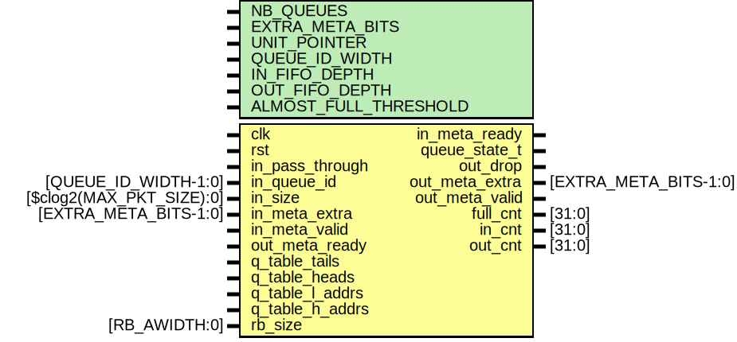

# Entity: queue_manager

- **File**: queue_manager.sv
## Diagram

## Description

 This module manages generic queues. It fetches the appropriate packet queue
 state and adds it to the packet's metadata. It also advances the queue's
 pointer. This means that packets cannot be dropped after they go through
 this module.

## Generics

| Generic name          | Type | Value             | Description                                   |
| --------------------- | ---- | ----------------- | --------------------------------------------- |
| NB_QUEUES             |      | undefined         | Number of queue in the module.                |
| EXTRA_META_BITS       |      | undefined         | Number of bits in the extra metadata.         |
| UNIT_POINTER          |      | 0                 | Set to 1 to advance pointer by a single unit. |
| QUEUE_ID_WIDTH        |      | $clog2(NB_QUEUES) | Queue ID width.                               |
| IN_FIFO_DEPTH         |      | 16                | Depth of the input FIFO.                      |
| OUT_FIFO_DEPTH        |      | 16                | Depth of the output FIFO.                     |
| ALMOST_FULL_THRESHOLD |      | undefined         | Almost full threshold for the output FIFO.    |
## Ports

| Port name       | Direction | Type                     | Description                                                                                                     |
| --------------- | --------- | ------------------------ | --------------------------------------------------------------------------------------------------------------- |
| clk             | input     |                          |                                                                                                                 |
| rst             | input     |                          |                                                                                                                 |
| in_pass_through | input     |                          | If set, the packet passes through without changing the queue state (i.e., we do not advance the queue pointer). |
| in_queue_id     | input     | [QUEUE_ID_WIDTH-1:0]     | Input metadata stream.                                                                                          |
| in_size         | input     | [$clog2(MAX_PKT_SIZE):0] | (In number of flits.)                                                                                           |
| in_meta_extra   | input     | [EXTRA_META_BITS-1:0]    |                                                                                                                 |
| in_meta_valid   | input     |                          |                                                                                                                 |
| in_meta_ready   | output    |                          |                                                                                                                 |
| queue_state_t   | output    |                          | Output metadata stream.                                                                                         |
| out_drop        | output    |                          |                                                                                                                 |
| out_meta_extra  | output    | [EXTRA_META_BITS-1:0]    |                                                                                                                 |
| out_meta_valid  | output    |                          |                                                                                                                 |
| out_meta_ready  | input     |                          |                                                                                                                 |
| q_table_tails   | input     |                          | BRAM signals for queues.                                                                                        |
| q_table_heads   | input     |                          |                                                                                                                 |
| q_table_l_addrs | input     |                          |                                                                                                                 |
| q_table_h_addrs | input     |                          |                                                                                                                 |
| rb_size         | input     | [RB_AWIDTH:0]            | Config signals.                                                                                                 |
| full_cnt        | output    | [31:0]                   | Number of packets dropped because the queue was full.                                                           |
| in_cnt          | output    | [31:0]                   | Number of input packets.                                                                                        |
| out_cnt         | output    | [31:0]                   | Number of output packets.                                                                                       |
## Instantiations

- q_table_a_tails: bram_interface_io
- q_table_a_heads: bram_interface_io
- q_table_a_l_addrs: bram_interface_io
- q_table_a_h_addrs: bram_interface_io
