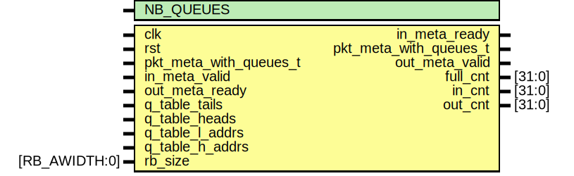

# Entity: rx_dsc_queue_manager

- **File**: rx_dsc_queue_manager.sv
## Diagram

## Description

## Generics

| Generic name | Type | Value     | Description |
| ------------ | ---- | --------- | ----------- |
| NB_QUEUES    |      | undefined |             |
## Ports

| Port name              | Direction | Type          | Description |
| ---------------------- | --------- | ------------- | ----------- |
| clk                    | input     |               |             |
| rst                    | input     |               |             |
| pkt_meta_with_queues_t | input     |               |             |
| in_meta_valid          | input     |               |             |
| in_meta_ready          | output    |               |             |
| pkt_meta_with_queues_t | output    |               |             |
| out_meta_valid         | output    |               |             |
| out_meta_ready         | input     |               |             |
| q_table_tails          | input     |               |             |
| q_table_heads          | input     |               |             |
| q_table_l_addrs        | input     |               |             |
| q_table_h_addrs        | input     |               |             |
| rb_size                | input     | [RB_AWIDTH:0] |             |
| full_cnt               | output    | [31:0]        |             |
| in_cnt                 | output    | [31:0]        |             |
| out_cnt                | output    | [31:0]        |             |
