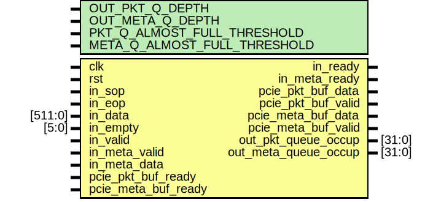

# Entity: pdu_gen

- **File**: pdu_gen.sv
## Diagram

## Generics

| Generic name                 | Type | Value                              | Description |
| ---------------------------- | ---- | ---------------------------------- | ----------- |
| OUT_PKT_Q_DEPTH              |      | 64                                 |             |
| OUT_META_Q_DEPTH             |      | 128                                |             |
| PKT_Q_ALMOST_FULL_THRESHOLD  |      | OUT_PKT_Q_DEPTH - MAX_PKT_SIZE * 2 |             |
| META_Q_ALMOST_FULL_THRESHOLD |      | OUT_META_Q_DEPTH - 8               |             |
## Ports

| Port name            | Direction | Type    | Description |
| -------------------- | --------- | ------- | ----------- |
| clk                  | input     |         |             |
| rst                  | input     |         |             |
| in_sop               | input     |         |             |
| in_eop               | input     |         |             |
| in_data              | input     | [511:0] |             |
| in_empty             | input     | [5:0]   |             |
| in_valid             | input     |         |             |
| in_ready             | output    |         |             |
| in_meta_valid        | input     |         |             |
| in_meta_data         | input     |         |             |
| in_meta_ready        | output    |         |             |
| pcie_pkt_buf_data    | output    |         |             |
| pcie_pkt_buf_valid   | output    |         |             |
| pcie_pkt_buf_ready   | input     |         |             |
| pcie_meta_buf_data   | output    |         |             |
| pcie_meta_buf_valid  | output    |         |             |
| pcie_meta_buf_ready  | input     |         |             |
| out_pkt_queue_occup  | output    | [31:0]  |             |
| out_meta_queue_occup | output    | [31:0]  |             |
