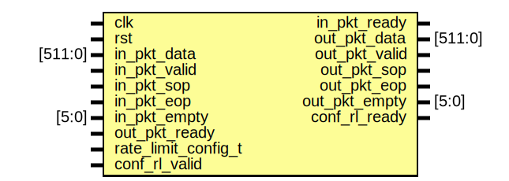

# Entity: rate_limiter

- **File**: rate_limiter.sv
## Diagram

## Description

## Ports

| Port name           | Direction | Type    | Description |
| ------------------- | --------- | ------- | ----------- |
| clk                 | input     |         |             |
| rst                 | input     |         |             |
| in_pkt_data         | input     | [511:0] |             |
| in_pkt_valid        | input     |         |             |
| in_pkt_ready        | output    |         |             |
| in_pkt_sop          | input     |         |             |
| in_pkt_eop          | input     |         |             |
| in_pkt_empty        | input     | [5:0]   |             |
| out_pkt_data        | output    | [511:0] |             |
| out_pkt_valid       | output    |         |             |
| out_pkt_ready       | input     |         |             |
| out_pkt_sop         | output    |         |             |
| out_pkt_eop         | output    |         |             |
| out_pkt_empty       | output    | [5:0]   |             |
| rate_limit_config_t | input     |         |             |
| conf_rl_valid       | input     |         |             |
| conf_rl_ready       | output    |         |             |
