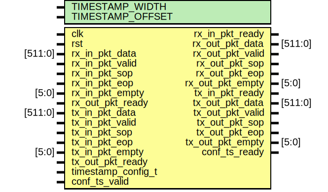

# Entity: timestamp

- **File**: timestamp.sv
## Diagram

## Description

 Timestamp outgoing packets and calculate RTT for incoming packets using this
 timestamp. For incoming packets we also replace the timestamp with the RTT
 (in number of cycles). Must be explicitly enabled using the configuration
 interface. Otherwise this module does nothing.

## Generics

| Generic name     | Type | Value    | Description |
| ---------------- | ---- | -------- | ----------- |
| TIMESTAMP_WIDTH  |      | 32       |             |
| TIMESTAMP_OFFSET |      | (112+32) |             |
## Ports

| Port name          | Direction | Type    | Description    |
| ------------------ | --------- | ------- | -------------- |
| clk                | input     |         |                |
| rst                | input     |         |                |
| rx_in_pkt_data     | input     | [511:0] | RX input.      |
| rx_in_pkt_valid    | input     |         |                |
| rx_in_pkt_ready    | output    |         |                |
| rx_in_pkt_sop      | input     |         |                |
| rx_in_pkt_eop      | input     |         |                |
| rx_in_pkt_empty    | input     | [5:0]   |                |
| rx_out_pkt_data    | output    | [511:0] | RX output.     |
| rx_out_pkt_valid   | output    |         |                |
| rx_out_pkt_ready   | input     |         |                |
| rx_out_pkt_sop     | output    |         |                |
| rx_out_pkt_eop     | output    |         |                |
| rx_out_pkt_empty   | output    | [5:0]   |                |
| tx_in_pkt_data     | input     | [511:0] | TX input.      |
| tx_in_pkt_valid    | input     |         |                |
| tx_in_pkt_ready    | output    |         |                |
| tx_in_pkt_sop      | input     |         |                |
| tx_in_pkt_eop      | input     |         |                |
| tx_in_pkt_empty    | input     | [5:0]   |                |
| tx_out_pkt_data    | output    | [511:0] | TX output.     |
| tx_out_pkt_valid   | output    |         |                |
| tx_out_pkt_ready   | input     |         |                |
| tx_out_pkt_sop     | output    |         |                |
| tx_out_pkt_eop     | output    |         |                |
| tx_out_pkt_empty   | output    | [5:0]   |                |
| timestamp_config_t | input     |         | Configuration. |
| conf_ts_valid      | input     |         |                |
| conf_ts_ready      | output    |         |                |
