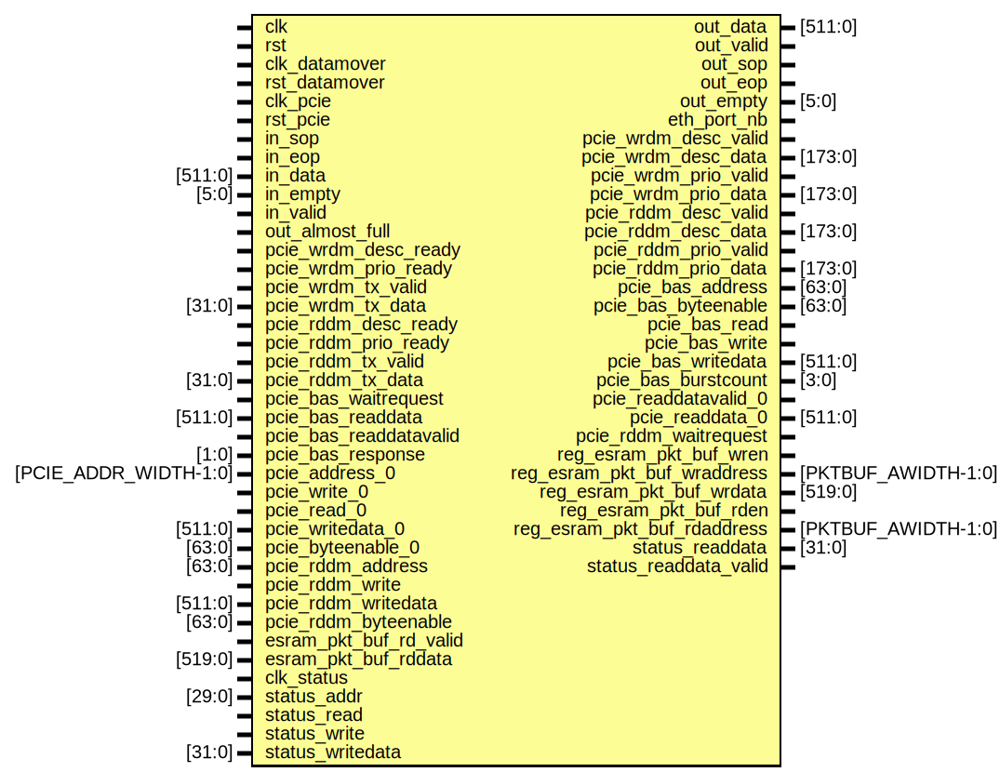

# Entity: top

- **File**: top.sv
## Diagram

## Ports

| Port name                   | Direction | Type                  | Description |
| --------------------------- | --------- | --------------------- | ----------- |
| clk                         | input     |                       |             |
| rst                         | input     |                       |             |
| clk_datamover               | input     |                       |             |
| rst_datamover               | input     |                       |             |
| clk_pcie                    | input     |                       |             |
| rst_pcie                    | input     |                       |             |
| in_sop                      | input     |                       |             |
| in_eop                      | input     |                       |             |
| in_data                     | input     | [511:0]               |             |
| in_empty                    | input     | [5:0]                 |             |
| in_valid                    | input     |                       |             |
| out_data                    | output    | [511:0]               |             |
| out_valid                   | output    |                       |             |
| out_sop                     | output    |                       |             |
| out_eop                     | output    |                       |             |
| out_empty                   | output    | [5:0]                 |             |
| out_almost_full             | input     |                       |             |
| eth_port_nb                 | output    |                       |             |
| pcie_wrdm_desc_ready        | input     |                       |             |
| pcie_wrdm_desc_valid        | output    |                       |             |
| pcie_wrdm_desc_data         | output    | [173:0]               |             |
| pcie_wrdm_prio_ready        | input     |                       |             |
| pcie_wrdm_prio_valid        | output    |                       |             |
| pcie_wrdm_prio_data         | output    | [173:0]               |             |
| pcie_wrdm_tx_valid          | input     |                       |             |
| pcie_wrdm_tx_data           | input     | [31:0]                |             |
| pcie_rddm_desc_ready        | input     |                       |             |
| pcie_rddm_desc_valid        | output    |                       |             |
| pcie_rddm_desc_data         | output    | [173:0]               |             |
| pcie_rddm_prio_ready        | input     |                       |             |
| pcie_rddm_prio_valid        | output    |                       |             |
| pcie_rddm_prio_data         | output    | [173:0]               |             |
| pcie_rddm_tx_valid          | input     |                       |             |
| pcie_rddm_tx_data           | input     | [31:0]                |             |
| pcie_bas_waitrequest        | input     |                       |             |
| pcie_bas_address            | output    | [63:0]                |             |
| pcie_bas_byteenable         | output    | [63:0]                |             |
| pcie_bas_read               | output    |                       |             |
| pcie_bas_readdata           | input     | [511:0]               |             |
| pcie_bas_readdatavalid      | input     |                       |             |
| pcie_bas_write              | output    |                       |             |
| pcie_bas_writedata          | output    | [511:0]               |             |
| pcie_bas_burstcount         | output    | [3:0]                 |             |
| pcie_bas_response           | input     | [1:0]                 |             |
| pcie_address_0              | input     | [PCIE_ADDR_WIDTH-1:0] |             |
| pcie_write_0                | input     |                       |             |
| pcie_read_0                 | input     |                       |             |
| pcie_readdatavalid_0        | output    |                       |             |
| pcie_readdata_0             | output    | [511:0]               |             |
| pcie_writedata_0            | input     | [511:0]               |             |
| pcie_byteenable_0           | input     | [63:0]                |             |
| pcie_rddm_address           | input     | [63:0]                |             |
| pcie_rddm_write             | input     |                       |             |
| pcie_rddm_writedata         | input     | [511:0]               |             |
| pcie_rddm_byteenable        | input     | [63:0]                |             |
| pcie_rddm_waitrequest       | output    |                       |             |
| reg_esram_pkt_buf_wren      | output    |                       |             |
| reg_esram_pkt_buf_wraddress | output    | [PKTBUF_AWIDTH-1:0]   |             |
| reg_esram_pkt_buf_wrdata    | output    | [519:0]               |             |
| reg_esram_pkt_buf_rden      | output    |                       |             |
| reg_esram_pkt_buf_rdaddress | output    | [PKTBUF_AWIDTH-1:0]   |             |
| esram_pkt_buf_rd_valid      | input     |                       |             |
| esram_pkt_buf_rddata        | input     | [519:0]               |             |
| clk_status                  | input     |                       |             |
| status_addr                 | input     | [29:0]                |             |
| status_read                 | input     |                       |             |
| status_write                | input     |                       |             |
| status_writedata            | input     | [31:0]                |             |
| status_readdata             | output    | [31:0]                |             |
| status_readdata_valid       | output    |                       |             |
## Signals

| Name        | Type  | Description                                      |
| ----------- | ----- | ------------------------------------------------ |
| sw_reset_r1 | logic | //////////////////////// /////////////////////// |
## Instantiations

- rate_limiter_inst: rate_limiter
- out_eth_store_forward_fifo: fifo_pkt_wrapper
- timestamp_inst: timestamp
- reg_io_inst: hyper_pipe_root
- input_comp_0: input_comp
- parser_0: parser
- parser_out_fifo: dc_fifo_wrapper_infill
- configurator_inst: configurator
- flow_table_wrapper_0: flow_table_wrapper
- flow_director_inst: flow_director
- flow_director_out_fifo: dc_fifo_wrapper_infill
- data_mover_0: basic_data_mover
- dm2pcie_fifo: dc_fifo_wrapper_infill
  - **Description**
 ///////////////// Datamover To PCIe FIFO //////////////////////////////////

- bp_dm2pcie_fifo: dc_back_pressure
- dm2pcie_meta_fifo: dc_fifo_wrapper_infill
- bp_dm2pcie_meta_fifo: dc_back_pressure
- pcie_tx_pkt_fifo: dc_fifo_wrapper_infill
- pdu_gen_inst: pdu_gen
  - **Description**
 ///////////////// Datamover To PDU_GEN //////////////////////////////////

- eth_out_pkt_fifo: dc_fifo_wrapper_infill
  - **Description**
 ///////////////// To OUTPUT FIFO //////////////////////////////////

- dc_bp_output_pkt_fifo: dc_back_pressure
- pktbuf_emptylist: dc_fifo_wrapper
  - **Description**
 ///////////////// PKT BUFFER and its Emptylist //////////////////////////////

- pcie: pcie_top
  - **Description**
 ///////////////PCIe logic ////////////////

